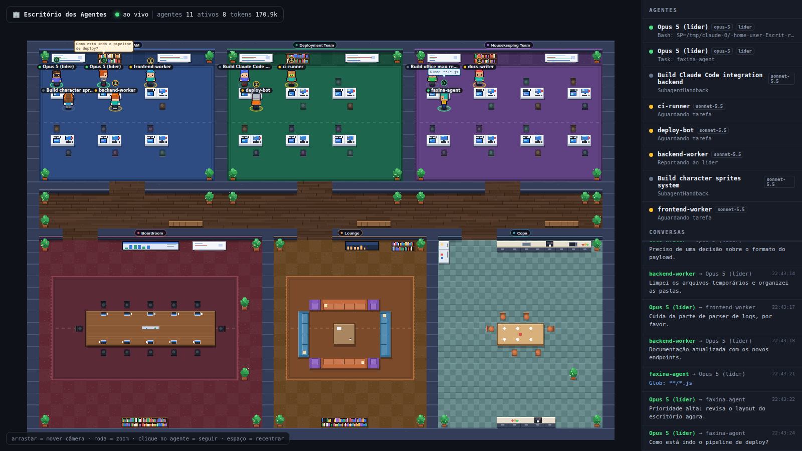

# 🏢 Escritório dos Agentes

Um escritório virtual em pixel art, estilo [Gather.town](https://gather.town), que mostra
**os agentes do Claude Code trabalhando e conversando** em tempo real. Cada sessão e cada
subagente vira um personagem que anda, senta na mesa do seu time, mostra o que está
fazendo e solta balões de fala quando pensa, chama uma ferramenta ou responde.



Roda 100% local. Sem build, sem framework, sem assets externos — todo o pixel art é
gerado proceduralmente em canvas.

```
┌─ Claude Code ──────────┐     ┌─ servidor (Node) ──────┐     ┌─ navegador ─────────┐
│ ~/.claude/projects/    │ ──► │ watcher → World state  │ ──► │ Canvas 2D + WS      │
│   <sessão>.jsonl       │tail │ Express + WebSocket    │ ws  │ mapa · personagens  │
└────────────────────────┘     └────────────────────────┘     └─────────────────────┘
                                          ▲
                        POST /api/event ──┘  (hooks ou qualquer outro sistema de agentes)
```

## Como rodar

```bash
npm install
npm start           # http://localhost:4317
```

Abra o navegador. Se você já tiver sessões do Claude Code na máquina, os agentes
aparecem sozinhos. Para ver o escritório cheio sem depender de sessão real:

```bash
npm run demo        # simulação com 1 orquestrador + 6 workers conversando
```

## Controles

| Ação | Como |
|---|---|
| Mover a câmera | arrastar com o mouse |
| Zoom | roda do mouse |
| Seguir um agente | clicar nele na lista lateral |
| Recentrar / ver tudo | `espaço` |

## Como a integração funciona

**1. Via logs (automático, zero configuração).** O servidor faz *tail* incremental dos
arquivos `~/.claude/projects/**/*.jsonl` que o Claude Code já escreve. Dali saem os
agentes (sessão principal = orquestrador; `isSidechain: true` = subagente/worker),
o status, a ferramenta em uso, os tokens e as falas.

Para observar outro diretório:

```bash
CLAUDE_PROJECTS_DIR=/caminho/para/projects npm start
```

**2. Via HTTP (qualquer sistema de agentes).** Dá pra plugar qualquer coisa:

```bash
curl -X POST localhost:4317/api/event -H 'content-type: application/json' -d '{
  "agent": { "id": "revisor-1", "name": "Revisor", "role": "worker",
             "model": "sonnet-5.5", "team": "DEV TEAM", "status": "working",
             "activity": "Lendo server/state.js" },
  "message": "Achei um off-by-one no parser", "kind": "result"
}'
```

**3. Via hooks do Claude Code.** Veja `examples/hooks.settings.json` — plugue no seu
`~/.claude/settings.json` para empurrar eventos de tool use direto pro escritório.

## Endpoints

| Rota | O que faz |
|---|---|
| `GET /api/state` | estado completo (agentes + mensagens) |
| `GET /api/health` | saúde, diretórios observados, nº de agentes |
| `POST /api/event` | ingestão externa |
| `WS /ws` | stream ao vivo (`snapshot` + incrementais) |

O protocolo completo e as interfaces entre os módulos estão em [`docs/CONTRACT.md`](docs/CONTRACT.md).

## Estrutura

```
server/
  index.js      Express + WebSocket, broadcast throttlado
  watcher.js    tail incremental dos .jsonl
  state.js      World: agentes, status derivado, mensagens
  ingest.js     normalização do POST /api/event
public/js/
  office.js     mapa, salas, mobília, assentos (render cacheado)
  sprites.js    geração procedural dos sprites 16x24
  characters.js personagens: pathfinding, animação, balões
  main.js       game loop e câmera
  net.js        cliente WebSocket com reconexão
  store.js      estado do cliente
  ui.js         painel lateral e HUD
scripts/demo.js simulação para testar sem sessão real
```

## Status dos agentes

| Cor | Status | Quando |
|---|---|---|
| 🟢 verde | `working` | usou uma ferramenta nos últimos 20s |
| 🟣 roxo | `thinking` | bloco de raciocínio em andamento |
| 🟡 amarelo | `waiting` | recebeu um prompt e ainda não respondeu |
| 🔵 azul | `done` | sessão encerrada |
| ⚪ cinza | `idle` | sem eventos há mais de 90s |
| 🔴 vermelho | `error` | erro reportado |
